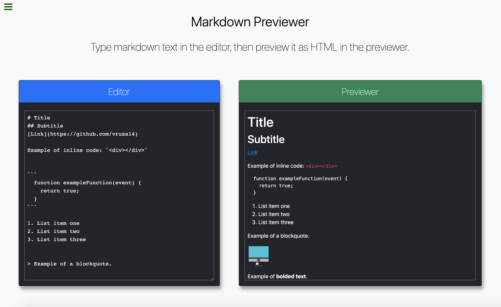
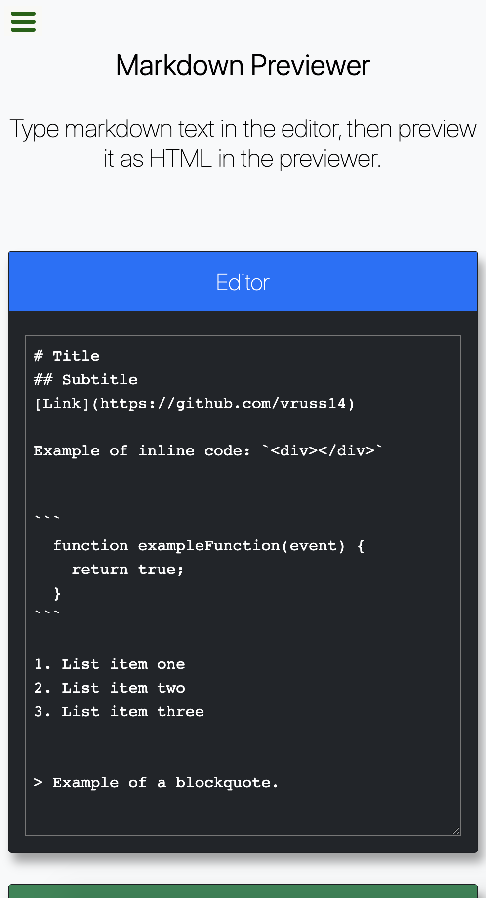

# Markdown Previewer

## Overview

A webpage built with React that dynamically parses markdown into HTML.

## Description

This page utilizes various frontend libraries and frameworks including Bootstrap, SASS, and React. This was an excellent opportunity for me to see how to use SASS with React. It was also a unique opportunity to understand how the marked library works, which is what parses the markdown into HTML.

In React, I usually built functional components, but I wanted to challenge myself and build this container component as a class component with a constructor and binding my methods to this. I'm glad that I did, because I feel like it helped me gain a better understanding of React. 

Overall, I am excited about what I learned in building this page and look forward to applying these concepts in future projects.

Please find the deployed page here: https://vruss14.github.io/preview-markdown

## Technologies Used

- HTML
- CSS
- Bootstrap
- SASS
- JavaScript
- React

## Installation

No installation steps are required to view this project. To view the page, visit the URL above. The application's source code can be found on GitHub here: https://github.com/vruss14/preview-markdown.

## Usage

This webpage includes responsive design and can be viewed on all devices.

Below is a screenshot of the desktop version of the deployed page:

Below is a screenshot of the deployed page on mobile:

## Credits

Valerie Russell was the sole contributor to this project. Contact her at vruss14@gmail.com.
